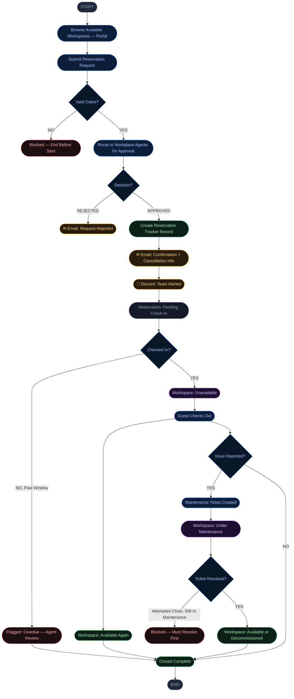

# WRM — Workspace Reservation Management (MVP)

> A ServiceNow scoped application that automates the end-to-end workspace
> booking process for hybrid office employees. Built as a capstone
> project on the ServiceNow platform.

---

## The Problem

Hybrid work has made office space unpredictable. Companies over-lease
or under-lease space because nobody has real visibility into who's
actually using what, and when.

- Global office utilization reached just 54% in 2025, meaning close
  to half of leased office space sits unused on an average day
  (JLL, 2025 Global Occupancy Planning Benchmark Report)
- Meeting rooms fare worse, averaging just 30% utilization globally
  (CBRE, 2025 Global Workplace & Occupancy Insights)
- No-show rates on room and desk bookings run as high as 25 to 40%,
  meaning booking data alone consistently overstates real usage
  (Skedda, Office Space Utilization: The Complete 2026 Guide)
- Manual booking systems (spreadsheets, email chains) offer no way
  to track any of this, leaving companies making real estate
  decisions with no reliable data behind them

---

## The Solution

WRM is a self-service ServiceNow application where employees browse
and request workspaces through a portal, get routed through
approval automatically, and have their reservation's full
lifecycle, check-in, check-out, and maintenance, tracked without
manual status updates from an agent.

---

## Scope and Context

ServiceNow already sells a mature, licensed product suite for this exact
problem space: [Workplace Service Delivery](https://www.servicenow.com/community/wsd-blog/workplace-service-delivery-what-s-new-in-the-january-30th/ba-p/3167731),
which includes indoor mapping, an event planner, lease administration,
and calendar sync with Outlook.

WRM is not an attempt to replicate that. It is an MVP built to prove out
the core platform mechanics from raw primitives, tables, business rules,
flows, ACLs, notifications, rather than configuring a pre-built app.
The goal was depth of understanding, not feature parity with a
commercial product.

---

## The Reservation Journey

Browse Workspace → Submit Request → Approval → Confirmation → Check-In → Check-Out → Maintenance (if flagged) → Closed



---

## Platform Features Used

| #  | Feature                                                          |
| --- | ---------------------------------------------------------------- |
| 01 | Scoped Application                                                |
| 02 | Tables & Forms (incl. Task extension)                             |
| 03 | UI Policies                                                       |
| 04 | UI Actions (custom-built, plus removal of OOB buttons)            |
| 05 | Data Policies                                                     |
| 06 | Roles & ACLs                                                      |
| 07 | Service Catalog Item (variables, reference qualifiers)            |
| 08 | Catalog Client Scripts                                            |
| 09 | Flow Designer                                                     |
| 10 | Script Includes                                                   |
| 11 | System Properties                                                 |
| 12 | REST Integration (Discord Webhook)                                |
| 13 | Business Rules                                                    |
| 14 | Notifications                                                     |
| 15 | SLAs                                                               |
| 16 | Service Portal (Portal, Pages, Role-Restricted Navigation)         |
| 17 | Custom Widget Development (Server Script, Angular Controller, HTML Template, CSS) |
| 18 | Knowledge Articles                                                 |
| 19 | Reports & Dashboards                                               |
| 20 | Source Control                                                     |

---

## Repository Structure

```
WRM/
│
├── README.md
│
├── servicenow-config/
│   ├── [app-hash-folder]/
│   └── sn_source_control.properties
│
├── docs/
│   ├── business-requirements.md
│   ├── technical-documentation.md
│   └── user-guide.md
│
├── scripts/
│   ├── ui-actions/
│   │   ├── ui-action-check-in.js
│   │   ├── ui-action-check-out.js
│   │   ├── ui-action-no-show.js
│   │   ├── ui-action-needs-maintenance.js
│   │   ├── ui-action-claim.js
│   │   └── removing-oob-buttons.md
│   │
│   ├── business-rules/
│   │   ├── business-rule-reservation-to-workspace-sync.js
│   │   ├── business-rule-reservation-status-to-state-sync.js
│   │   ├── business-rule-maintenance-to-workspace-sync.js
│   │   └── business-rule-block-invalid-closure.md
│   │
│   ├── client-scripts/
│   │   └── catalog-client-script-date-validation.js
│   │
│   ├── script-includes/
│   │   └── discord-notification.js
│
├── portal-widgets/
│   ├── available-workspaces/
│   │   ├── server-script.js
│   │   ├── client-controller.js
│   │   ├── html-template.html
│   │   └── styles.css
│   │
│   ├── hero-banner/
│   │   ├── server-script.js
│   │   ├── client-controller.js
│   │   ├── html-template.html
│   │   └── styles.css
│   │
│   ├── recent-notifications/
│   │   ├── server-script.js
│   │   ├── client-controller.js
│   │   ├── html-template.html
│   │   └── styles.css
│   │
│   ├── knowledge-articles/
│   │   ├── server-script.js
│   │   ├── client-controller.js
│   │   ├── html-template.html
│   │   └── styles.css
│   │
│   └── my-reservations/
│       ├── server-script.js
│       ├── client-controller.js
│       ├── html-template.html
│       └── styles.css
│
├── update-set/
│
│
└── screenshots/
    ├── portal-homepage.png
    ├── workspace-detail-modal.png
    ├── reservation-request-form.png
    ├── approval-and-discord-alert.png
    ├── reservation-tracker-record.png
    ├── my-reservations-widget.png
    └── dashboard.png
```

---

## Documentation

- [Business Requirements](https://github.com/emeka-iwu/WRM/blob/main/docs/business-requirements.md)
- [Technical Documentation](https://github.com/emeka-iwu/WRM/blob/main/docs/technical-documentation.md)
- [User Guide](https://github.com/emeka-iwu/WRM/blob/main/docs/user-guide.md)

---

## The Team

| Name       | Role         |
| ---------- | ------------ |
| Emeka Iwu  | Project Lead |

---

## Screenshots

> Screenshots of the live application are in the [screenshots](https://github.com/emeka-iwu/WRM/blob/main/screenshots) folder.

---

## Future Enhancements

- **Scheduled cleanup job** — a nightly scheduled script to auto
  check-out reservations whose booking window ended with no manual
  check-out, and to flag overdue pending check-ins for agent review.
  Designed, not yet implemented.
- **CMDB/CI-linked availability** — tying each workspace to a supporting
  compute CI (bare-metal host, VM, cloud instance) so that infrastructure
  health automatically drives workspace availability, rather than relying
  solely on agent-driven maintenance flags. Scoped and designed, not yet
  implemented.
- **Self-service cancellation** — currently reservations can only be
  cancelled by contacting an agent directly.
- **Event Management integration** — replacing direct CI status polling
  with a proper Event → Alert → Action pipeline for production-scale
  infrastructure monitoring.

---

## Importing into ServiceNow

To import this application into a ServiceNow PDI:

1. Fork or clone this repository
2. In ServiceNow Studio, go to **Source Control, then Import from Source Control**
3. Point to this repository using the **servicenow-config/** folder, not the root of the repository
4. Use branch: **main**

> Note: Only the `servicenow-config/` folder contains the Studio
> app export. Do not link to the parent folder.

Importing can also be done via Update Set found [here](https://github.com/emeka-iwu/WRM/blob/main/update-set)

---

*Built while working full-time in healthcare support. Designed to turn spare
office capacity into a system people can actually see and trust.*
